# archtecture

## system overview

```mermaid
graph TB
    subgraph gui [gui (primary interface)]
        PC[persona cards]
        KG[knowledge graph<br/>d3]
        TB[tag browser<br/>ao3-style]
        ME[memory explorer]
        PM[permissions matrix]
        SF[sharing flow diagram]
        RL[retrieval log]
        DD[decay dashboard]
    end

    subgraph core [core engine]
        IDX[indexing service]
        RET[retrieval pipeline<br/>7-step, 6 signals]
        DCY[decay service]
        TW[tag wrangler]
        SBX[sandbox enforcer]
    end

    subgraph stores [data stores]
        FB[falkordb<br/>graph: nodes, edges, tags]
        PG[supabase/postgres<br/>metadata, permissions, sharing]
        ST[storage<br/>multimodal files]
        VEC[vector store<br/>mem0 / pgvector]
    end

    subgraph adapters [adapters (stack-agnostic)]
        SA[storage adapter]
        VA[vector adapter]
    end

    PC --> IDX
    KG --> RET
    TB --> TW
    ME --> IDX
    PM --> SBX
    SF --> SBX
    RL --> RET
    DD --> DCY

    IDX --> SA
    RET --> SA
    RET --> VA
    DCY --> SA
    TW --> SA
    SBX --> SA

    SA --> FB
    SA --> PG
    SA --> ST
    VA --> VEC
```

## retrieval pipeline architecture

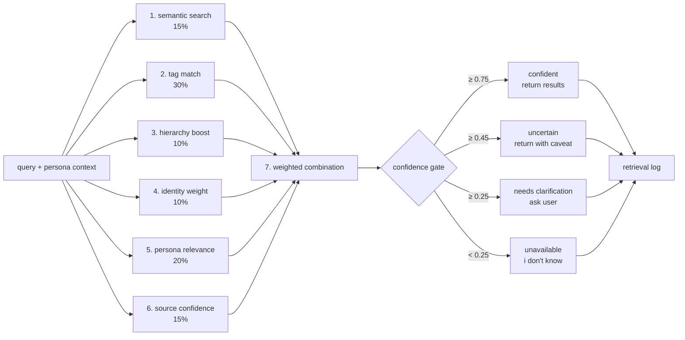

## memory indexing flow

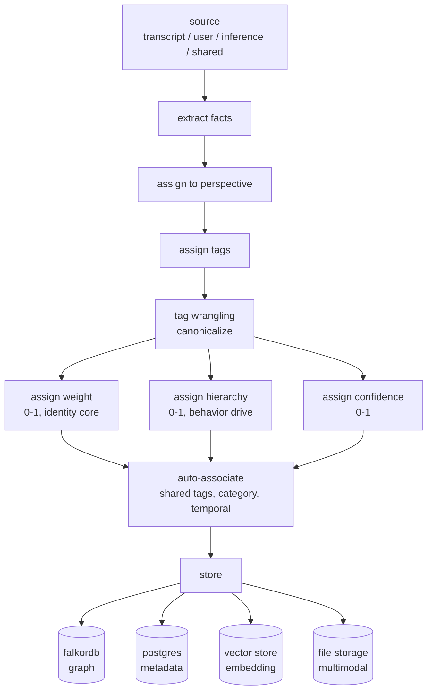

## persona pov switching

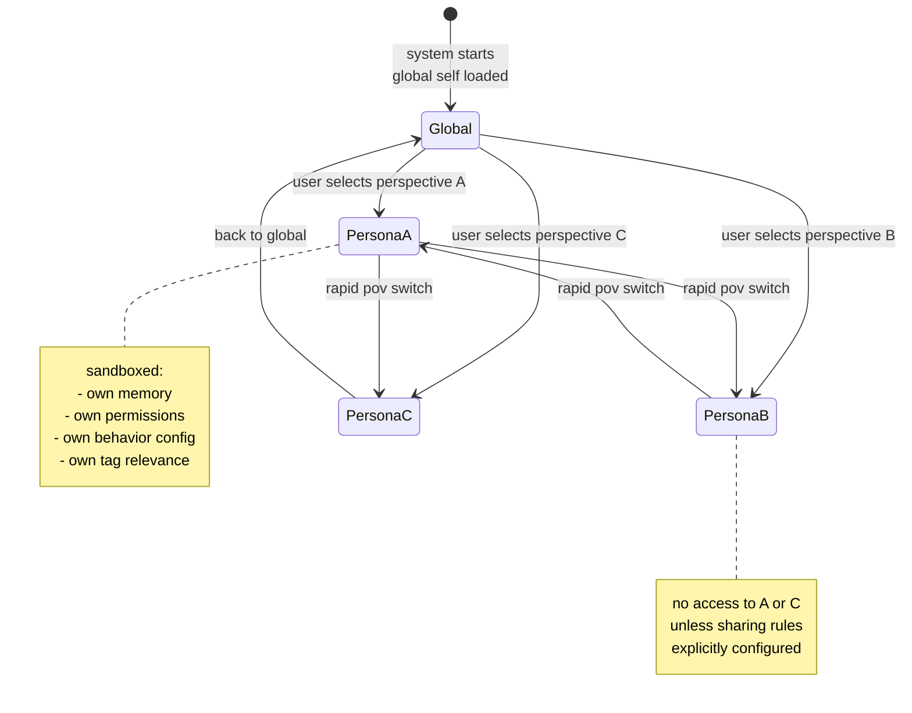

## sandbox enforcement flow

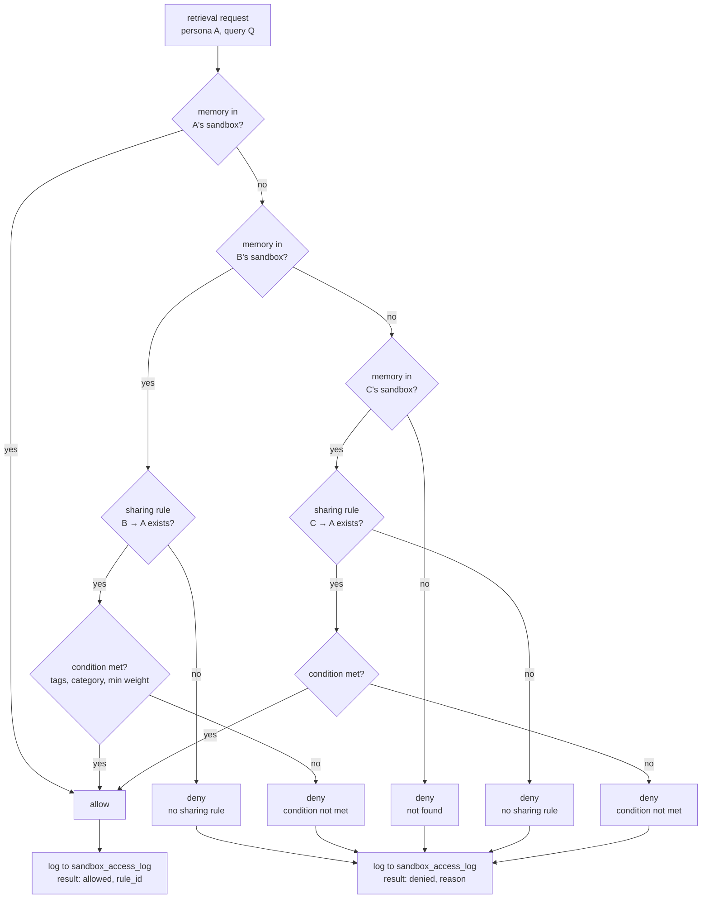

## data model

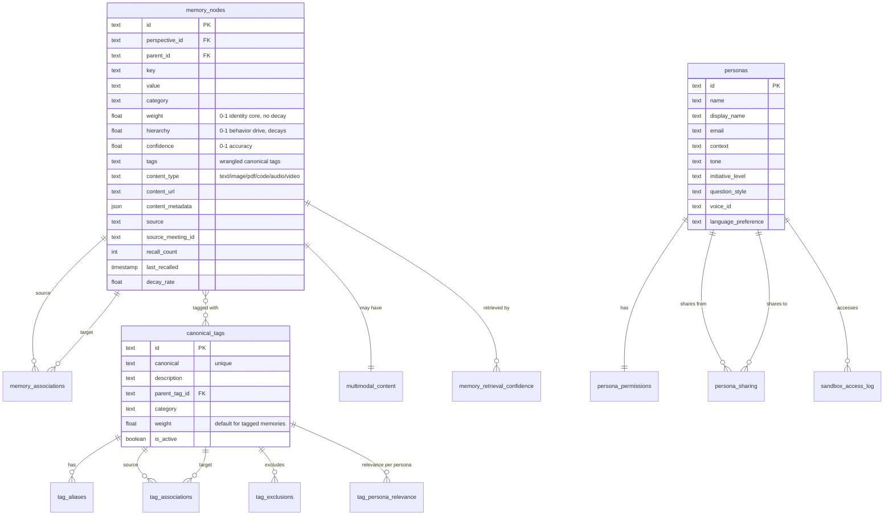

## storage adapter architecture

```mermaid
graph TB
    subgraph core [memorium core (stack-agnostic)]
        CORE[core engine<br/>indexing, retrieval, decay, wrangling]
        IFC[storage interface<br/>CRUD + query contract]
    end

    subgraph adapters [adapters (you implement for your stack)]
        PA[postgres adapter]
        SA[sqlite adapter]
        FA[falkordb adapter]
        RA[redis adapter]
        SUP[supabase adapter]
    end

    subgraph vectors [vector adapters]
        MA[mem0 adapter]
        PV[pgvector adapter]
        PI[pinecone adapter]
        WE[weaviate adapter]
    end

    CORE --> IFC
    IFC --> PA
    IFC --> SA
    IFC --> FA
    IFC --> RA
    IFC --> SUP
    CORE --> IFC
    IFC --> MA
    IFC --> PV
    IFC --> PI
    IFC --> WE
```

## gui component architecture

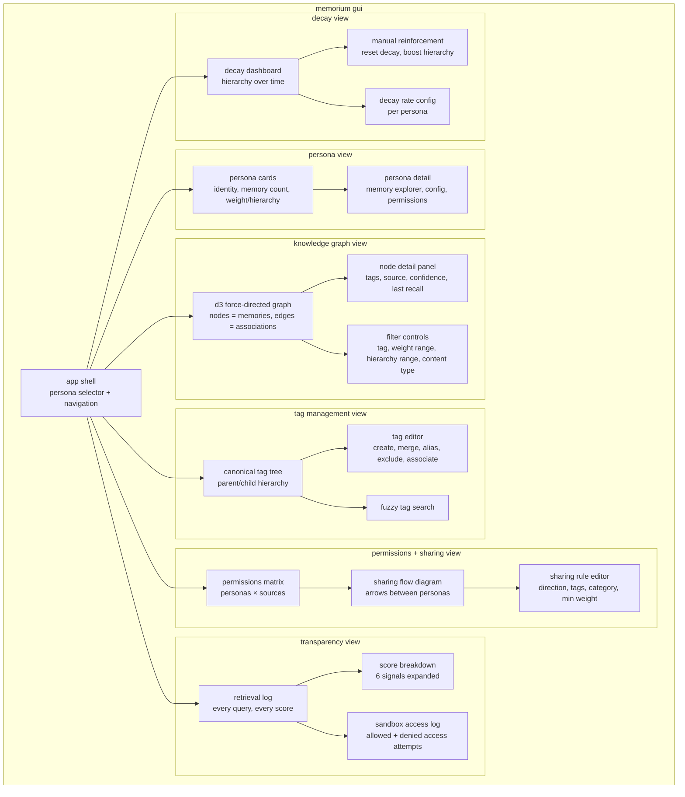

## cross-domain associativity graph

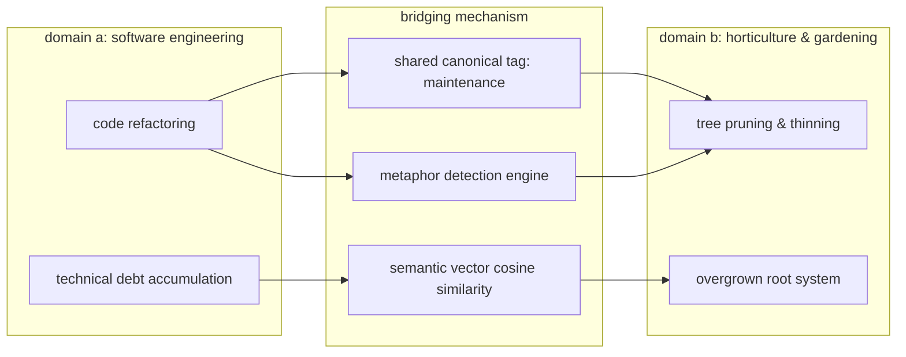

## typed associations er diagram

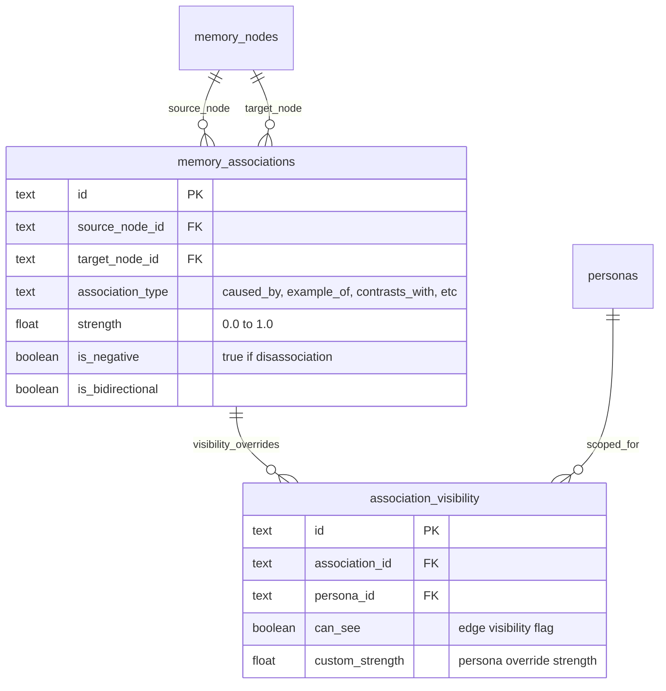

## temporal memory state machine

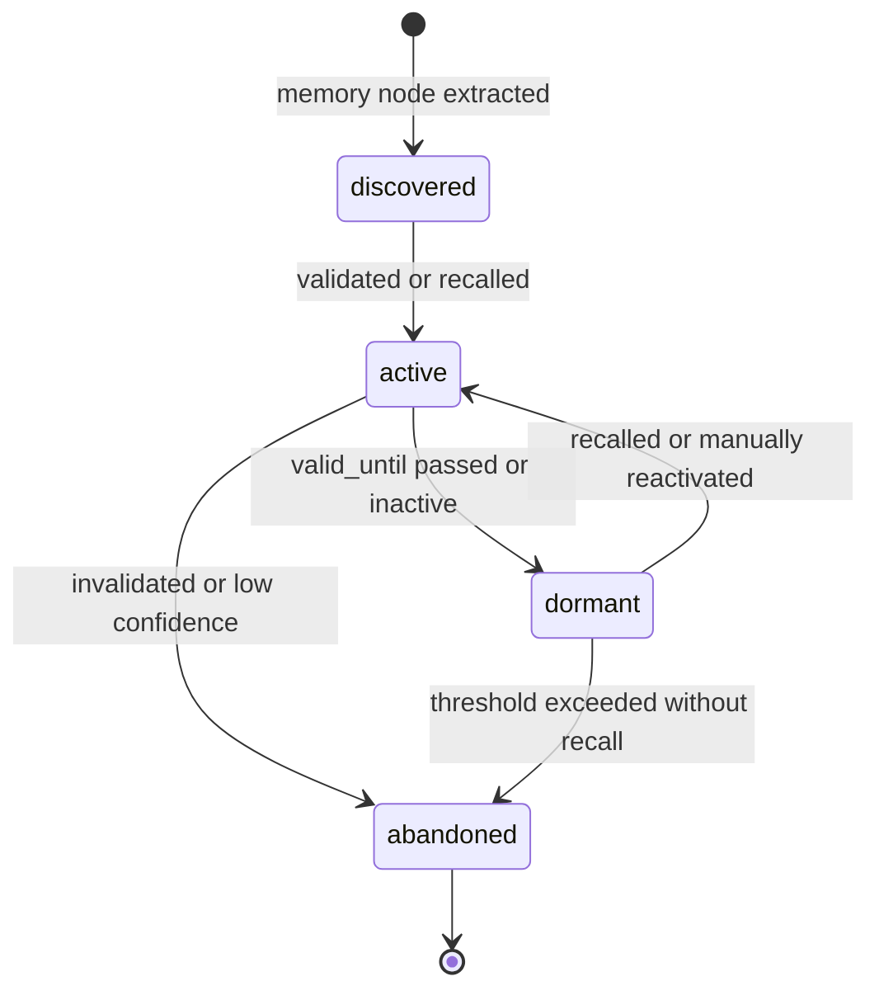

## contradiction handling flow

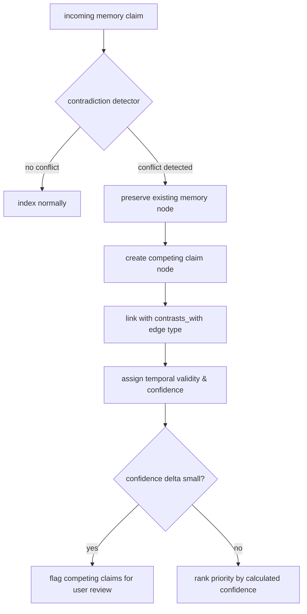

## provenance + lineage chain

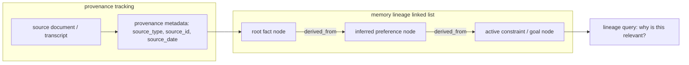

## ephemeral memory promotion pipeline

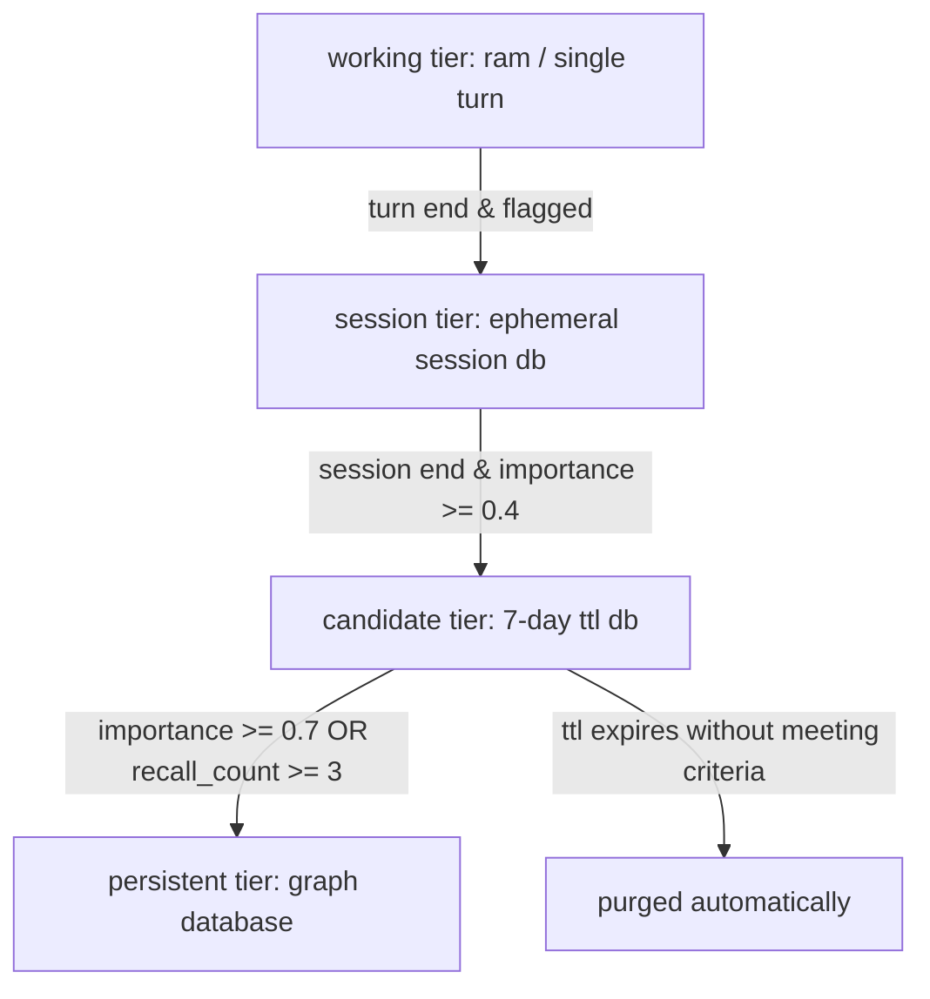

## associative retrieval modes

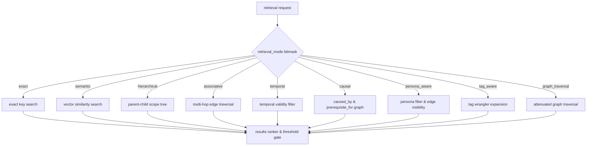

## association permissions check flow

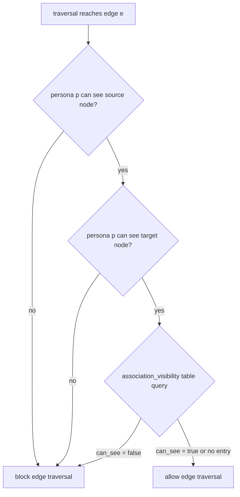
