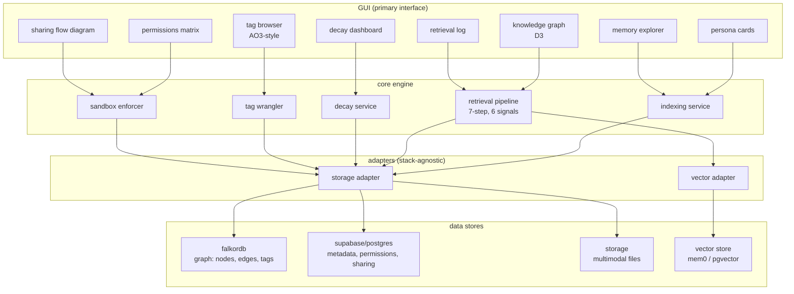
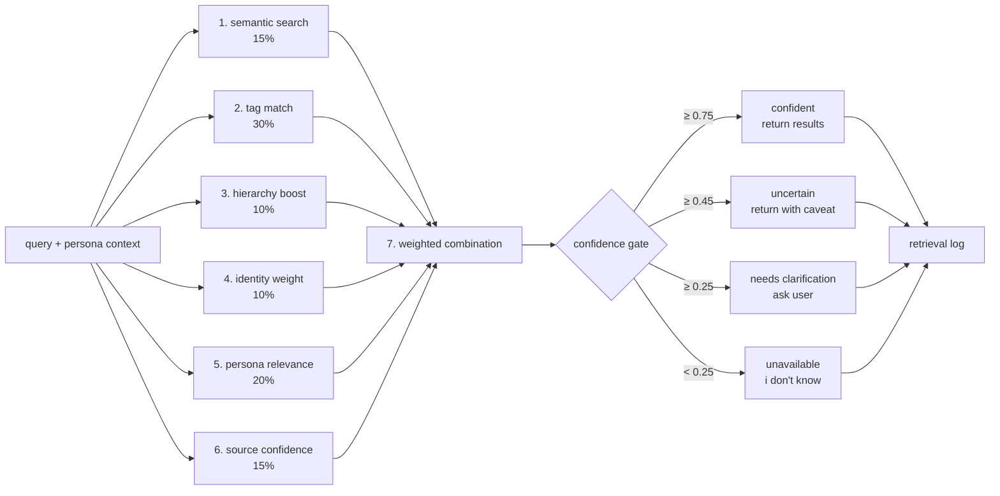
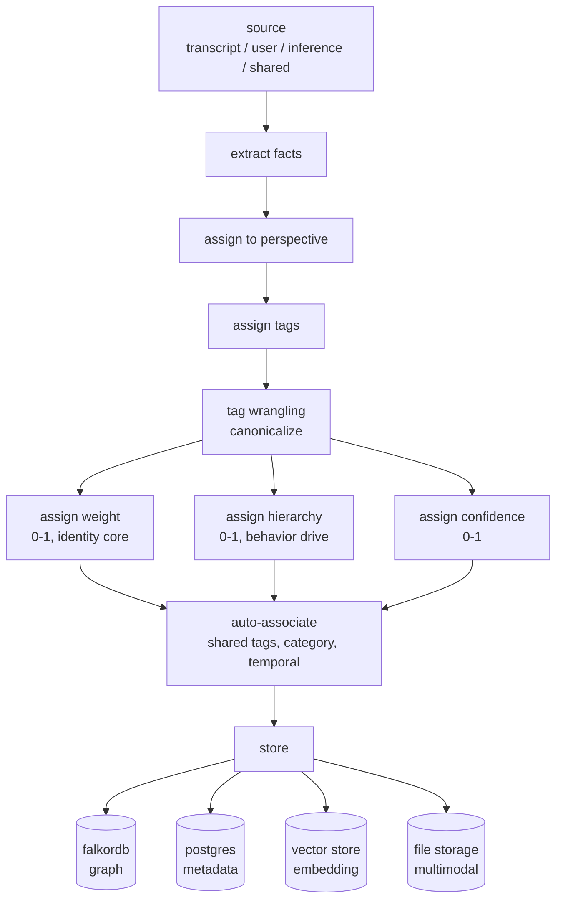
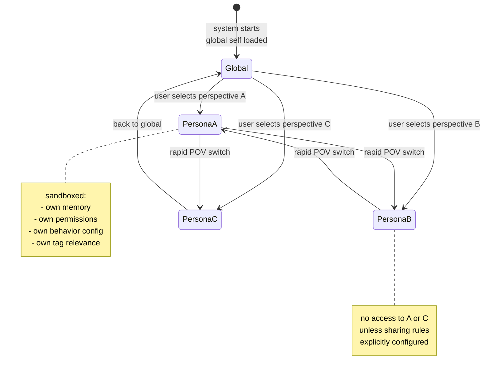
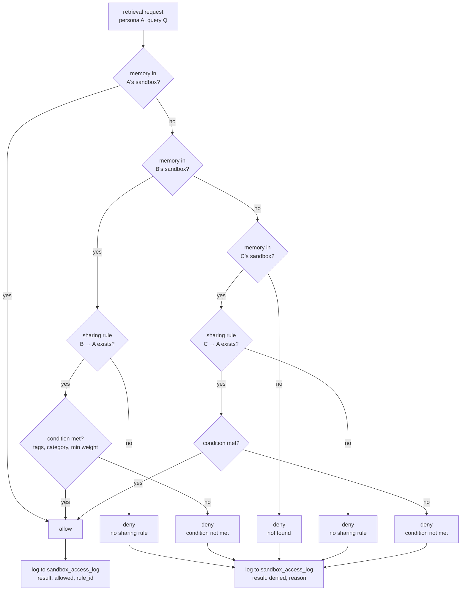
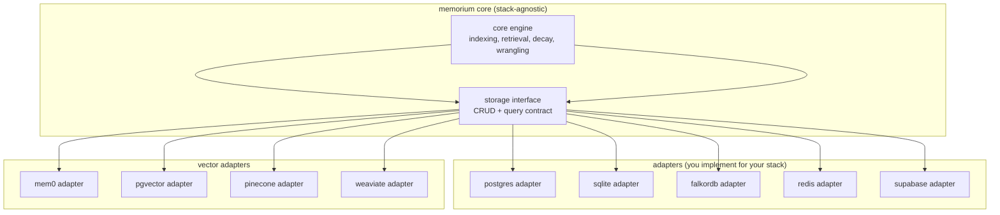

# archtecture

## system overview

## retrieval pipeline architecture

## memory indexing flow

## persona POV switching

## sandbox enforcement flow

## data model

## storage adapter architecture

## GUI component architecture

